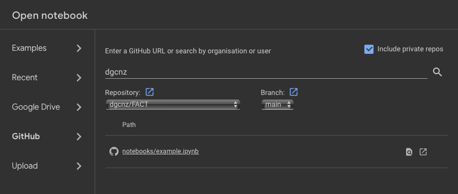

Remove branch names when anonymizing

# Reproducing Post-hoc Concept Bottleneck Models

## Running the example notebook in Google Colab

The example notebook has everything you need to start testing the code, give it a try in Google Colab.

1. Go to Google Colab
2. In the `Open Notebook` tab, select GitHub
3. Select the repository `dgcnz/FACT` (remove when anonymizing)
4. Select the notebook `notebooks/example.ipynb`



If you choose to test on your local computer, then follow the instructions below.

## Installing local dependencies

You have two options to install the dependencies: poetry (recommended) or conda.

### Poetry

Check the [documentation](https://python-poetry.org/docs/) on how to setup and install poetry.

1. Create a virtual environment.

```sh
python -m venv .venv
```
2. Activate the python environment.
```sh
# For UNIX-based systems only
source .venv/bin/activate 
# For Windows cmd only
.venv\Scripts\activate.bat 
# For Windows Powershell
.venv\Scripts\Activate.ps1
```

3. Install the dependencies in the virtual environment.

```sh
poetry install
```
And you're done!

For adding/removing packages, and other functionalities check the [docs](https://python-poetry.org/docs/).


### Conda

1. Create conda environment and install packages
```sh
conda env create -f environment.yaml
```
2. Activate environment
```sh
conda activate fact
```

## Downloading datasets

All datasets will reside on `artifacts/data`. When commiting changes to the repository, please make sure it doesn't get pushed, otherwise it will clog the repo.

If desired, you can run the data downloader scripts in the [main](/notebook/main.ipynb) notebook. Otherwise if you prefer running the files via terminal then follow the instructions below:

### Broden

1. Activate your environment (conda or venv).
2. Run the download script below:
```sh
./scripts/download_broden
```
3. You will find the downloaded data in `broden_concepts`.

### COCO-Stuff

1. Activate your environment (conda or venv).
2. Run the download script below:
```sh
./scripts/download_cocostuff
```
3. You will find the downloaded data in `COCO_STUFF`.

### CUB

1. Run the download script below:
```sh
./scripts/download_cub
```
2. You will find the downloaded data in `CUB_200_2011` and `class_attr_data_10`.

### Derm7pt

Please refer to the [main](/notebook/main.ipynb) file for instructions regarding the Derm7pt dataset.

### HAM10000

1. Please refer to the [main](/notebook/main.ipynb) file for instructions regarding the HAM10000 dataset due to the necessity of having a Kaggle API token (if you already have one setup in your \.kaggle, folder, you can ignore this step).
2. Run the download script below:
```sh
./scripts/download_ham
```

(_Note:_ If on Google Colab, you can run the cell in the [main](/notebook/main.ipynb) file after following the instructions there.)

3. You will find the downloaded data in `HAM10K`.

### SIIM-ISIC

1. Activate your environment (conda or venv).
2. Run the download script below:
```sh
./scripts/download_siim
```
3. You will find the downloaded data in `SIIM_ISIC`.

### Metashift

1. Run the download script below:
```sh
./scripts/download_metashift
```
2. You will find the downloaded data in `metashift`.

## Extension Experiment Downloads

The below downloads are not part of the original experiments and were done as an extension to the original paper. They amount to around 7 GB in total.

### ESC-50

1. Run the download script below:
```sh
./scripts/download_esc
```
2. You will find the downloaded data in `ESC_50`.

### UrbanSound8K

1. Please refer to the [main](/notebook/main.ipynb) file for instructions regarding the UrbanSound8K dataset due to the necessity of having a Kaggle API token (if you already have one setup in your \.kaggle, folder, you can ignore this step).
2. Run the download script below:
```sh
./scripts/download_us8k
```

(_Note:_ If on Google Colab, you can run the cell in the [main](/notebook/main.ipynb) file after following the instructions there.)

3. You will find the downloaded data in `US8K`.

### AudioCLIP Dependencies

This script will download the dependencies for AudioCLIP, as the original repository has been integrated here in its entirety already. Run this (either in the notebook or terminal) if you would like to run the AudioCLIP experiments.

1. Run the download script below:
```sh
./scripts/download_audioclip
```
2. Instead of in `artifacts/data`, You will find the downloaded data in `FACT/models/AudioCLIP/assets`.


## Downloading the Backbones
Please see `models/model_zoo.py` for the backbones used. Some of the original models rely on external dependencies (e.g. [pytorchcv](https://pypi.org/project/pytorchcv/) for the CUB backbone, [OpenAI repo](https://github.com/openai/CLIP) for the CLIP backbone.) or will be downloaded (e.g. HAM1000 model from the [DDI repo](https://drive.google.com/drive/folders/1oQ53WH_Tp6rcLZjRp_-UBOQcMl-b1kkP)). 


Any additional models can be added by editing `models/model_zoo.py`.

# Replicating the Original Results
To replicate the original results, we have prepared a function where all the datasets can be evaluated using the parameters specified by the authors. This can be found [here](/notebook/main.ipynb).

**Please Note:** For some scripts (outlined in the above notebook), you may need to add this code snippet before the `python` command itself: `PYTHONPATH=models:.:$PYTHONPATH NO_AUDIOCLIP=1`. This is due to how the repository is setup. Alternatively, you could install the AudioCLIP dependencies (the instructions for which can be found above) if you don't want to include this for some scripts.

# Learning Concepts
In the original paper, two different ways to learn concepts activations vectors were proposed to build concepts banks which are used here. 

## 1 - Learning Concepts with a Concept Dataset
To learn concepts in this way, each concept dataset needs to have a set of positive and negative images per concept. For this, the original authors proposed the CAV methodology (Kim et al. 2018). <br>

**Concept Dataset Implementations:** The code provided to extract concept data loaders in `data/concept_loaders.py` is the same as in the original implementation. In there, you could find the loaders for `Broden`, `CUB`, and `derm7pt` datasets to extract concept loaders. If you'd like to use custom concept datasets, you could implement your own loader and place there.

**Obtaining concept vectors**: Once you have the concept data loaders, you could use the `learn_concepts_dataset.py` script to learn the concept vectors (which is also from the original implementation). As examples, you can run the following scripts (once you obtain the corresponding datasets):
```
OUTPUT_DIR=/path/where/you/save/conceptbanks/
# Learning CUB Concepts
python3 learn_concepts_dataset.py --dataset-name="cub" --backbone-name="resnet18_cub" --C 0.001 0.01 0.1 1.0 10.0 --n-samples=100 --out-dir=$OUTPUT_DIR

# Learning Derm7pt Concepts
python3 learn_concepts_dataset.py --dataset-name="derm7pt" --backbone-name="ham10000_inception" --C 0.001 0.01 0.1 1.0 10.0 --n-samples=50 --out-dir=$OUTPUT_DIR

# Learning Broden Concepts
python3 learn_concepts_dataset.py --dataset-name="broden" --backbone-name="clip:RN50" --C 0.001 0.01 0.1 1.0 10.0 --n-samples=50 --out-dir=$OUTPUT_DIR

```

Alternatively, you can run example experiments in the [main](/notebook/main.ipynb) file.

**Limitations**: 
1. This approach relies on the existence of a concept dataset. These may be hard to get, depending on the application. 
2. Learning concepts with the CAV way could inherit the potential biases in the concept datasets. One should be careful about how the concept dataset is constructed, and what it means to learn that concept. 


## 2 - Learning concepts via prompting with multimodal models
What if we don't have a concept dataset? We could leverage multimodal models, such as [CLIP](https://arxiv.org/abs/2103.00020)! In other words, we can simply prompt the text encoder with the concept name, and obtain the concept vector in the shared embedding space. 

The code to do this can be found in `learn_concepts_multimodal.py`. You can run the following script to learn the concept vectors:
```
python3 learn_concepts_multimodal.py --backbone-name="clip:RN50" --classes=cifar10 --out-dir=$OUTPUT_DIR --recurse=1
```

Currently, CIFAR10/CIFAR100 is supported for this approach. You can very easily add the set of class names in the script and obtain the concept bank for your own purpose. 

**Limitations**: This approach is limited to the multimodal models that have a shared embedding space. Existing multimodal models that are not specialized may not do very well with domain-specific concepts (e.g. healthcare concepts).

# Training PCBMs
Once you have a concept bank and a backbone, you are ready to train your PCBM! We provide the code to train PCBMs in `train_pcbm.py`. You can run the following script to train a PCBM on CUB:
```
python3 train_pcbm.py --concept-bank="${OUTPUT_DIR}/cub_resnet18_cub_0.1_100.pkl" --dataset="cub" --backbone-name="resnet18_cub" --out-dir=$OUTPUT_DIR --lam=2e-4
```
Please see the `train_pcbm.py` file for the arguments / where the models are saved. 


**Limitation**: There is a tradeoff between the regularization and how sparse/"interpretable" (yes, hard to define what exactly this means) the linear module is. This hyperparameter selection can be a bit tedious. We can play around with the `lam` parameter and `alpha` parameter to observe the concept coefficients and understand what seems like a good tradeoff. Good thing is, we can simply monitor concept weights, and since concepts are more meaningful, we may have a better say here.


## Training PCBM-h
Once you have the PCBM, you can train the PCBM-h model by running the following script:
```
pcbm_path="/path/to/pcbm_cub__resnet18_cub__cub_resnet18_cub_0__lam:0.0002__alpha:0.99__seed:42.ckpt"
python3 train_pcbm_h.py --concept-bank="${OUTPUT_DIR}/cub_resnet18_cub_0.1_100.pkl" --pcbm-path=$pcbm_path --out-dir=$OUTPUT_DIR --dataset="cub"
```

## 3 - Model Editing

With our current implementation, we can evaluate the performance of model editing using one script (also present in `main.ipynb`), which is the following:

```
%%capture 
# Suppress output with capture magic
PYTHONPATH=models:.:$PYTHONPATH NO_AUDIOCLIP=1 python -m experiments.model_editing.make_table \
    --seed 0 \
    --device cpu \
    --base_config configs/model_editing/classifier/base_clip_resnet50.yaml
```

The above will perform the model editing experiments for the 6 scenarios and one seed.

For replicating the results of the user study, [please see this notebook](/notebooks/user_study.ipynb). The instructions for these experiments aren't present here because it is much simpler to view them there and due to the dataset not being publishable due to GDPR.


# Citation (REMOVE for secret repo)
If you find this code useful, please consider citing our paper:
```
@inproceedings{
midavaine2024posthoc,
title={On the Reproductibility of Post-hoc Concept Bottleneck Models},
author={Nesta Midavaine and Gregory Go and Diego Cánez Ildefonso and Ioana Simion},
booktitle={None},
year={2024}
}
```

In addition, we also recommend citing the original authors via the citation below:
```
@inproceedings{
yuksekgonul2023posthoc,
title={Post-hoc Concept Bottleneck Models},
author={Mert Yuksekgonul and Maggie Wang and James Zou},
booktitle={The Eleventh International Conference on Learning Representations },
year={2023},
url={https://openreview.net/forum?id=nA5AZ8CEyow}
}
```
